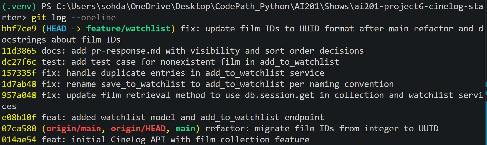

# PR Response Doc — CineLog Watchlist Feature

Screenshot of `git log --oneline`:

## AI Usage
<!-- Fill in at the end — how you used AI tools during this project -->
I used the AI tools during this project for codebase orientation and verifying commit format. For codebase orientation, I gave the AI the add_to_collection function in services/collection_service.py, and asked for the walkthrough of this function step-by-step and deduplication check in this function. It generated the steps from inputs to the returning object of the function, and explained the deduplication check that it looks for an existing collection entry from the same user and the same film. I used these responses to implement the deduplication check for add_to_watchlist function in services/watchlist_service.py by following the same logic as add_to_collection function in services/collection_service.py.

## Comment 1 — Rename
**What I did:** I changed the save_to_watchlist(user_id, film_id) function in services/watchlist_service.py to add_to_watchlist(user_id, film_id). I also changed the call sites in routes/watchlist/watchlist.py.
**How I verified:** I verified this change by restarting the flask server since it got crashed due to the ImportError at routes/watchlist/watchlist.py. After I reran the server, I did not get any errors or crashed out.

## Comment 2 — Deduplication
**What I did:** I added the deduplication logic to the add_to_watchlist(user_id, film_id) by following the same logic in add_to_collection(user_id, film_id, rating=None) in services/collection_service.py. When the duplicate is detected, it just returns the existing entry instead of creating a new one.
**How I verified:** I verified this change by using the flask shell, adding the sample film to the database, and adding this film to the watchlist 2 times. When adding it at the second time, the entry user_id is same as the first time, which confirms that the deduplication logic works.

## Comment 3 — Missing test
**What I did:** I added the test case in tests/test_watchlist.py for add_to_watchlist(user_id, film_id) for making sure to raise an error when adding a nonexistent film in the database to the watchlist.
**How I verified:** I verified by running pytest tests/test_watchlist.py -v and confirming it passed. I also ran pytest tests/ -v to confirm no test suites crashed.

## Comment 4 — Default visibility
**My position:** Keep `public=True` as the default setting when a user creates or adds a film to their watchlist. 
**Reasoning:** CineLog is a community film tracking platform that comes from the community interaction, film discovery, and sharing recommendations with friends. Making the watchlists public can reduce friction for users who want to share the movie tastes with each other or see what their friends plan to watch next.
**Tradeoff acknowledged:** The tradeoff is the user privacy that if a user wants their watchlist to be private but forgets to change the visibility setting, they will show a personal list of films in public. However, optimizing for community discovery follows the CineLog's primary platform goals, and the privacy risk can be improved by letting the user to change the visibility settings.

## Comment 5 — Sort order
**My position:** Update the watchlist order by most recently date-added when a user creates or adds a film to their watchlist.
**Reasoning:** A watchlist is a dynamic queue, not a static library index, so when a user adds a film, their interest in watching that specific movie is at its peak. Sorting by the newest additions ensures these high-interest films are immediately accessible from the top of the watchlist and most users see what they added recently.
**Engagement with reviewer's point:** The maintainer is correct that an alphabetical sort forces unnecessary scrolling for active users trying to find their latest additions. Switching to a chronological order can resolve this friction so that all users can see what they added recently on the list.

## Comment 6 — Rebase
**What conflicted:** The upstream main branch migrated Film.id from an integer to a UUID string, causing a structural mismatch with the WatchlistEntry schema which was still expecting an integer film_id.
**How I resolved it:** I fetched origin and rebased feature/watchlist onto origin/main. Then, I updated the WatchlistEntry class in models.py to change the film_id key column to `db.String(36)` to match the updated Film model UUID structure. I also modified the docstrings in routes/watchlist/watchlist.py and services/watchlist_service.py to define that film_id is the UUID of the film.
**How I verified no conflict remains:** I verified no conflict remains by rerunning the flask server and getting none of the errors, and running the pytests again and ensured that the watchlist and collection code still work with the UUID-based model. I also ran `git log --merges --oneline` command to confirm that the history is completely linear and free of merge commits

## PR Description
<!-- Written at the end — feature overview, design decisions, manual testing steps -->
The watchlist feature lets a user save films they want to watch later. A user can add a film to their watchlist through the POST endpoint. A user can also view their watchlist through the GET endpoint. The two design decisions I made are visibility default and sort order. The watchlist can be viewed publicily as the default setting, and it is sorted by the most recently date-added. This means that the newly saved film is added at the top of the watchlist, and it is visible by default unless it is explicitly changed to private.
For testing the watchlist feature, it has to start the app by running `python app.py`, and use a curl command to hit the endpoint in the another terminal (`curl http://127.0.0.1:5000/films/`). For the watchlist feature, it has to test the add endpoint (`curl -X POST http://127.0.0.1:5000/watchlist/test-user/add \ -H "Content-Type: application/json" \ -d '{"film_id": "<a-real-film-uuid>"}'`), then view the watchlist (`curl http://127.0.0.1:5000/watchlist/test-user`). It can also use the Flask shell by running `flask shell` in the terminal, and then manually create an app context and call the service functions for adding the films to the watchlist.